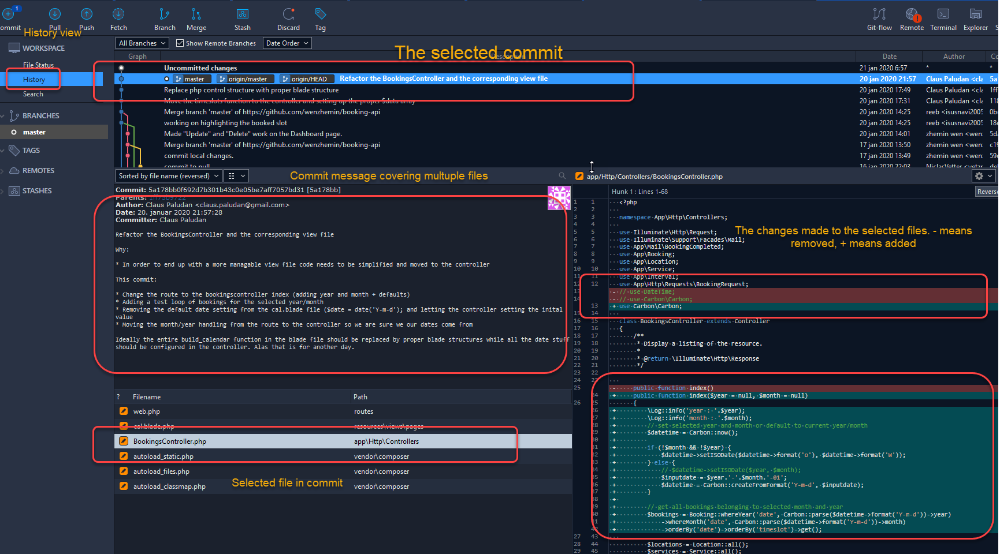
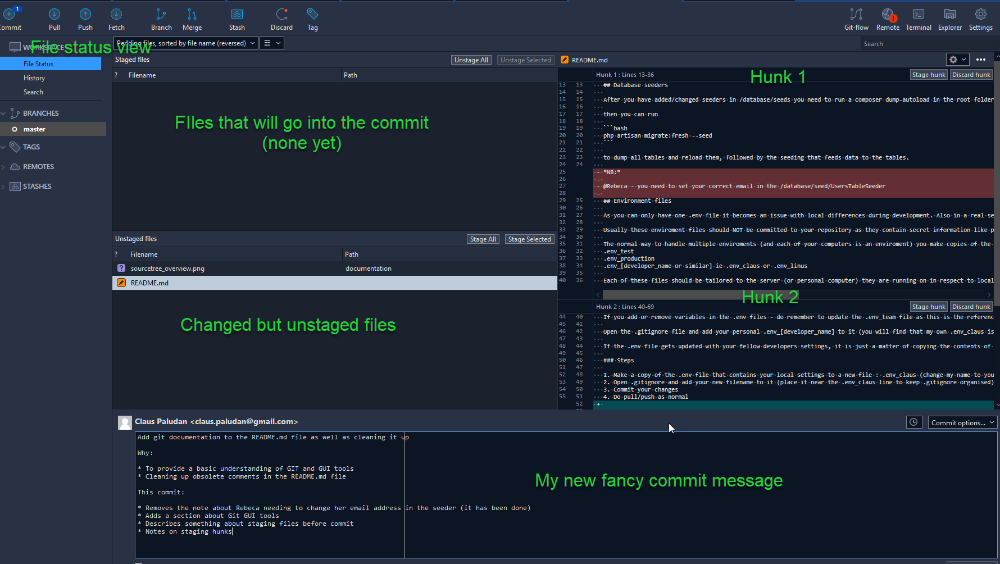
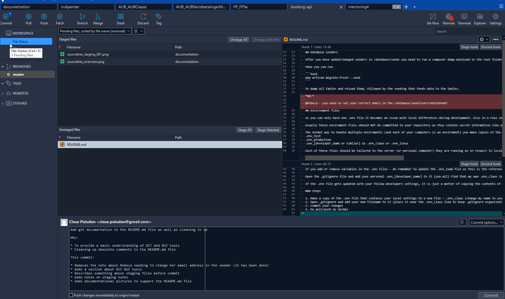
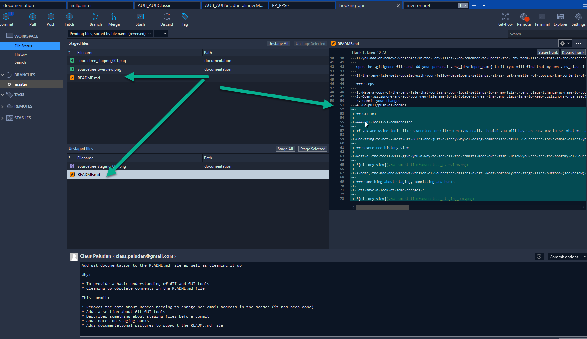

# Project information

## APP_URL

APP_URL in .env needs to be set to your local servername (localhost or whatever)

## Setting up mailtrap.io

- Go to mailtrap.io and register a free acount
- Go to settings on the demo inbox (icon on the right side of the page)
- Copy the username and password (strange sequences of numbers and letters) and paste them into the approprate field in .env

## Database seeders

After you have added/changed seeders in /database/seeds you need to run a composer dump-autoload in the root folder of the application

then you can run

```bash
php artisan migrate:fresh --seed
```

to dump all tables and reload them, followed by the seeding that feeds data to the tables.

## Environment files

As you can only have one .env file it becomes an issue with local differences during development. Also in a real setup you might have different environments like development, test, staging and production.

Usually these enviroment files should NOT be committed to your repository as they contain secret information like passwords and stuff. This is not that important in private projekts etc, but keep it in mind.

The normal way to handle multiple enviroments (and each of your computers is an enviroment) you make copies of the .env file and name them like this:
.env_test
.env_production
.env_[developer_name or similar] ie .env_claus or .env_linus

Each of these files should be tailored to the server (or personal computer) they are running on in respect to local URLS, passwords, database names etc.

If you make changes to your local environment - first update your own .env_XXXX file so you are sure that you don't loose the changes. Then copy the contents of your file to the .env file and test them out.

If you add or remove variables in the .env files - do remember to update the .env_team file as this is the reference file you should use to share .env updates with each other.

Open the .gitignore file and add your personal .env_[developer_name] to it (you will find that my own .env_claus is already there)

If the .env file gets updated with your fellow developers settings, it is just a matter of copying the contents of your own file into the .env file and you are all set.

### Steps

1. Make a copy of the .env file that contains your local settings to a new file : .env_claus (change my name to your own)
2. Open .gitignore and add your new filename to it (place it near the .env_claus line to keep .gitignore organised)
3. Commit your changes
4. Do pull/push as normal

## GIT 101

### GUI Tools vs commandline

If you are using tools like Sourcetree or GitKraken (you really should) you will have an easy way to see what was done to each file in each commit. You can accomplish the same using the commandline interface, but it takes a bit more skill to getting used to. Tools like these makes it very easy to track changes and if you venture into actual branches at some point (hopefully you will when you get a job) these tools will help you manage these as well.

One thing to not - most Git GUI's are just a fancy way of doing commandline stuff. Sourcetree for example offers you the possibility to see the commands used to fetch, pull, push etc but they are way more advanced in their use of parameters and such.

## Sourcetree history view

Most of the tools will give you a way to see all the commits made over time. Below you can see the anatomy of Sourcetrees history view:



A note, the mac and windows version of Sourcetree differs a bit. Most noteably the stage files buttons (see below) do not exist in the Mac version for some reason.

### Something about staging, committing and hunks

Lets have a look at some changes :



Explanation:

- **Staged files** - files (or parts/hunks of a file) that will be committed
- **Unstaged files** - files that have been changed but not yet been selected to be committed (OR - a file with unstaged hunks in it, even though you may have selected other hunks from that file to be committed)
- **Commit message** -  A fancy new commit message that will explain to you what I have been doing in this commit and more importantly, the WHY.
- **Hunks** - 2 different hunks (separate changes to a file)

So - in order to add (a) file(s) to a commit, select the file(s) and choose **[Stage selected]**

Below you can see that I have added two files to the commit or staging area.



This means that **IF** I press the commit button (lower right corner) - **ONLY** the two image files will be added to this commit.

But as you can see from my commit message, this is not what I want. I need to add the README.md file as well. (I just can't do that yet - as I am currently writing it)

I could however choose to add the first hunk to the staging area - this hunk contains the note for Rebeca, that she should add her proper email address to the UsersTableSeeder. As she have done that, the note is no longer relevant.



So looking at the picture above - README.md now appears both in the **Unstaged files** and in the **Staged files**.

What does this mean? - It means that if I choose to commit now, the note about Rebeca **WILL** be committed together with the two image files. **BUT** all my new fancy stuff about GIT will **NOT**. I could chose to split all the changed files into two commits instead.

The first one with only the update about Rebeca and the second one with the GIT documentation. However, I am a lazy sod so I will just commit everything at once and keep my fancy commit message.

So what are the uses for the hunks of a file? They are very useful if you begin working with atomic commits.

### Atomic commits

_"But what are atomic commits?"_

Atomic commits are small commits that handles only one change. So for example the calendar cleanup.

I made a change to the route (web.php) file in order to make the public calendar accept the year and month in the url.
I changed the controller method to accept these two parameters
I changed the view file so it provides the correct urls for changing months etc.

Committing these changes and ONLY these changes makes it:

- possible to revert that specific commit and undo my changes WITHOUT undoing other unrelated stuff
- possible to write a very specific commit message about WHAT I have changed and WHY I have changed it.

This is very important, because when you come back to this code in a month or two and hundres of changes have been made, you might wonder what happened. The commit message will tell you everything you need to know and you will have an easier task to undo the changes if you need to.

So even though you forgot to commit one small change at a time, using hunks in ie Sourcetree you will be able to make small commits selecting the files and/or hunks that relates to that specific change.

Trust me - it WILL do you good in the future.

Doing small commits and writing the proper commit message to go along with it will also help your self to stay more focused on the whats and whys of why you are doing it.

[Light reading about atomic commits](https://dev.to/cbillowes/why-i-create-atomic-commits-in-git-kfi)
[Somewhat longer reading about commit messages](https://dev.to/jacobherrington/how-to-write-useful-commit-messages-my-commit-message-template-20n9)

### Good commit messages

Commit messages are your chance to explain your self to others and to your future self. Git will help you to see what has been changed, but the commit message will help you understand WHY a change was made. You will see some of the what explained in the message, but is more highlevel than just mentioning each code change.

Sometimes you don't even need to look at the code because the commit message tells you everything you need to know.

Example of a good commit message:

```text
Refactor the coupon UI

Because:
- The old UI code is fairly slow
- There were a few unused dependencies
- The old UI has aged poorly

I thought it was necessary to remove some of the old coupon UI code.
Unfortunately, it has aged pretty poorly, and I think this refactor makes
the code much easier to support in the long-run. Primarily, this commit
improves the performance of the coupon component. It also removes some
unused dependencies.

These changes should resolve issue #1337.

This commit removed the left-pad dependency, so please stop using it!

Co-authored-by: nspinazz89 <nick@example.com>
```

Another example:

```text
# If applied, this commit will...

# Why is this change needed?
Prior to this change,

# How does it address the issue?
This change

# Provide links to any relevant tickets, articles or other resources```
